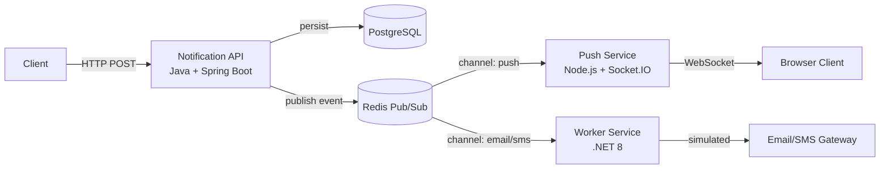

```markdown
# Notification Dispatcher

A high-performance, polyglot microservices system designed for scalable and resilient notification delivery.  
Built with Java, Node.js, and .NET to demonstrate real-world backend engineering practices.

---

## System Architecture

Decoupled, event-driven microservices architecture using Redis Pub/Sub.



---

## Services Breakdown

| Service              | Technology              | Responsibility                                      |
|----------------------|-------------------------|-----------------------------------------------------|
| Notification API     | Java + Spring Boot 3    | Validation, idempotency, rate limiting, persistence |
| Push Service         | Node.js + Socket.IO     | Real-time WebSocket notifications                   |
| Worker Service       | .NET 8 Worker           | Background processing (email/SMS simulation)        |
| Redis                | —                       | Message broker (Pub/Sub)                            |
| PostgreSQL           | —                       | Persistent audit storage                            |

---

## Tech Stack

- Java 21 + Spring Boot 3
- Node.js 20 + Express + Socket.IO
- .NET 8 Worker Service
- Redis (Pub/Sub)
- PostgreSQL 16
- Docker + Docker Compose

---

## Core Features

- Polyglot microservices architecture
- Event-driven communication with Redis Pub/Sub
- Idempotency control (Redis)
- Rate limiting per client
- Real-time delivery via WebSockets
- Background job processing
- Full Docker containerization with health checks

---

## Project Structure

```bash
.
├── notification-service-java/
├── notification-service-nodejs/
├── notification-worker-dotnet/
├── docker-compose.yml
├── .env.example
├── scripts/
│   └── test-api.sh
```

---

## Getting Started

### 1. Clone
```bash
git clone https://github.com/wsethw/Notification-Dispatcher.git
cd Notification-Dispatcher
```

### 2. Environment
```bash
cp .env.example .env
```

### 3. Run
```bash
docker compose up --build
```

### 4. Access

| Service                  | URL                          |
|--------------------------|------------------------------|
| Notification API         | http://localhost:8080        |
| WebSocket Push Service   | http://localhost:3000        |
| PostgreSQL               | localhost:5432               |
| Redis                    | localhost:6379               |

---

## API Example

**POST** `/api/v1/notifications`

```json
{
  "clientId": "user-123",
  "channel": "push",
  "message": "Hello world",
  "idempotencyKey": "unique-key-123"
}
```

Response (200):
```json
{
  "notificationId": "550e8400-e29b-41d4-a716-446655440000",
  "status": "PENDING"
}
```

---

## Event Flow

1. Client → Java API
2. Validation + rate limit + idempotency check
3. Persist in PostgreSQL
4. Publish event to Redis
5. Worker (Node.js or .NET) consumes and delivers

---

## Engineering Highlights

- **Idempotency** – prevents duplicate processing using Redis
- **Rate Limiting** – configurable per clientId
- **Event-Driven** – loose coupling and high resilience
- **Polyglot** – best tool for each job

---

## Testing

```bash
# Smoke test (end-to-end)
./scripts/test-api.sh          # Linux / macOS
npm run smoke:ps               # Windows (PowerShell)
```

Unit tests are also available in each service.

---

## Docker Execution

```bash
docker compose up --build
```

Includes health checks, volumes, and proper service ordering.

---

## Current Limitations

- No authentication (open for demo)
- Email/SMS delivery is simulated
- No persistent delivery logs
- No CI/CD or observability

---

## Future Enhancements

- JWT/OAuth2 authentication
- Real email/SMS providers (Twilio, SendGrid)
- Observability (OpenTelemetry + Grafana)
- CI/CD pipeline
- Dead Letter Queue

---

## License

MIT License

---

Built as a portfolio project to demonstrate distributed systems, async architecture, and production-grade patterns.
