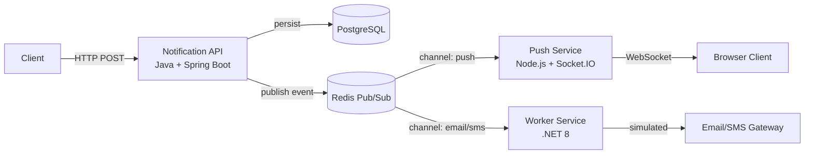

# Notification Dispatcher


A high-performance, polyglot microservices system designed for scalable and resilient notification delivery.  
Built with Java, Node.js, and .NET to demonstrate real-world backend engineering practices.

---

## System Architecture

Decoupled, event-driven microservices architecture using Redis Pub/Sub.



All services communicate asynchronously. The Java API handles validation and persistence, then delegates delivery to specialised workers via Redis channels.

---

## Services Breakdown

| Service | Technology | Responsibility |
|---------|------------|----------------|
| Notification API | Java 21 + Spring Boot 3 | Request handling, validation, idempotency (Redis), rate limiting (per client), persistence (PostgreSQL), event dispatch |
| Push Service | Node.js 20 + Express + Socket.IO | Real-time WebSocket notifications to connected browser clients |
| Worker Service | .NET 8 Worker | Background processing for email/SMS (currently simulated) |
| Redis | 7.2 | Message broker (Pub/Sub), idempotency cache |
| PostgreSQL | 16 | Persistent audit storage for notifications |

---

## Tech Stack

- Java 21 + Spring Boot 3
- Node.js 20 + Express + Socket.IO
- .NET 8 Worker Service
- Redis (Pub/Sub)
- PostgreSQL 16
- Docker + Docker Compose

---

## Core Features

- Polyglot microservices architecture
- Event-driven communication with Redis Pub/Sub
- Idempotency control (Redis-backed, 7-day TTL)
- Rate limiting per client (configurable window and max requests)
- Real-time delivery via WebSockets
- Background job processing
- Full Docker containerization with health checks and dependency ordering

---

## Project Structure

```bash
.
├── notification-service-java/     # Spring Boot API
├── notification-service-nodejs/   # WebSocket push service
├── notification-worker-dotnet/    # .NET background worker
├── docker-compose.yml
├── .env.example
├── scripts/
│   └── test-api.sh                # Smoke test script
```

---

## Environment Variables

Create a `.env` file from `.env.example` with the following variables:

```bash
# PostgreSQL
POSTGRES_DB=notificationdb
POSTGRES_USER=admin
POSTGRES_PASSWORD=changeme

# Redis
REDIS_URL=redis://redis:6379

# Optional: service ports (defaults work)
SERVER_PORT=8080          # Java API
PUSH_SERVICE_PORT=3000    # Node.js push service
```

All values are pre‑configured for local development. Change them as needed.

---

## Quick Demo (3 steps)

1. **Start the environment**
   ```bash
   docker compose up --build
   ```

2. **Send a notification**
   ```bash
   curl -X POST http://localhost:8080/api/v1/notifications \
     -H "Content-Type: application/json" \
     -d '{
       "clientId": "user-123",
       "channel": "push",
       "message": "Hello world",
       "idempotencyKey": "unique-123"
     }'
   ```

3. **Observe the result**
   - Response includes a `notificationId` and `status: PENDING`.
   - Real‑time push clients (WebSocket) receive the message.
   - Logs show the .NET worker consuming the event (simulated).

For a complete walkthrough, see the **Testing Guide** below.

---

## API Example

**Endpoint:** `POST /api/v1/notifications`

**Request body:**
```json
{
  "clientId": "user-123",
  "channel": "push",
  "message": "Hello world",
  "idempotencyKey": "unique-key-123"
}
```

**Success response (200 OK):**
```json
{
  "notificationId": "550e8400-e29b-41d4-a716-446655440000",
  "status": "PENDING"
}
```

**Error responses:**
```json
// 429 Too Many Requests
{
  "error": "Rate limit exceeded",
  "retryAfter": 30
}

// 409 Conflict (duplicate idempotency key)
{
  "error": "Duplicate request",
  "notificationId": "existing-uuid"
}

// 400 Bad Request
{
  "error": "Validation failed",
  "details": "Channel must be one of: push, email, sms"
}
```

---

## Event Flow

1. Client sends HTTP POST request to the Java API.
2. API validates input, applies rate limiting per `clientId`, and checks idempotency using Redis.
3. API persists the notification record in PostgreSQL.
4. API publishes an event to the appropriate Redis channel (`push`, `email`, or `sms`).
5. The corresponding worker consumes the event:
   - Node.js push service delivers real‑time notifications via WebSocket.
   - .NET worker logs the email/SMS (simulated).
6. Delivery status is logged (persistent audit logs not yet implemented – see Current Limitations).

---

## Engineering Highlights

- **Idempotency** – Prevents duplicate processing using Redis as a short‑term cache for `idempotencyKey`. Each key is stored for 7 days.
- **Rate Limiting** – Configurable per `clientId` with a sliding window or fixed window (implementation‑dependent). Protects the system from abuse.
- **Event‑Driven Design** – Loose coupling between services. The API does not wait for delivery; workers operate independently, improving scalability and resilience.
- **Polyglot Architecture** – Each service uses the most suitable runtime: Java for transactional API, Node.js for real‑time WebSockets, .NET for background processing.

---

## Testing

### Smoke test (end‑to‑end)
```bash
# Linux / macOS
./scripts/test-api.sh

# Windows (PowerShell)
npm run smoke:ps
```

### Service‑specific tests
Each service includes unit/integration tests. Run them individually:

```bash
# Java API
cd notification-service-java
./mvnw test

# Node.js push service
cd notification-service-nodejs
npm install
npm test

# .NET worker
cd notification-worker-dotnet
dotnet test
```

---

## Running the Environment

```bash
docker compose up --build
```

**Published ports:**

| Service | Port |
|---------|------|
| Notification API (Java) | 8080 |
| WebSocket Push (Node.js) | 3000 |
| PostgreSQL | 5432 |
| Redis | 6379 |

**Includes:**
- Health checks for all services
- Dependency orchestration (PostgreSQL and Redis start before APIs)
- Persistent volumes for PostgreSQL and Redis

---

## Operational Notes

- The Java API serves as the single entry point for all notification requests.
- The Node.js push service maintains WebSocket connections and broadcasts messages to subscribed clients in real time.
- The .NET worker consumes only `email` and `sms` channels; it simulates sending by logging the payload. No external email/SMS provider is integrated.
- Idempotency keys are stored in Redis with a 7‑day TTL, after which the same key may be reused.
- Rate limiting is applied in‑memory in the Java API; for horizontal scaling, a distributed rate limiter (Redis‑based) would be required – see Future Enhancements.

---

## Current Limitations

The Notification Dispatcher is a **portfolio‑grade demonstration** and is not intended for production use without further development. Known limitations include:

- **No authentication** – The API is completely open. Anyone with network access can send notifications. (CORS is open for local development.)
- **Email/SMS delivery is simulated** – The .NET worker only logs messages. No integration with Twilio, SendGrid, AWS SNS, etc.
- **No persistent delivery logs** – Success/failure of actual delivery (email, SMS, push) is not stored. Only the initial notification record is persisted.
- **No CI/CD pipeline** – Builds and deployments are manual.
- **Limited observability** – No centralised logging, metrics (Prometheus), or distributed tracing.
- **No Dead Letter Queue (DLQ)** – Failed messages are not retried or sent to a DLQ for later analysis.
- **No horizontal scaling** – Rate limiting is local to a single Java instance. Scaling the API horizontally would require a distributed rate limiter (e.g., Redis‑based).

---

## Future Enhancements

The following improvements are planned for subsequent iterations:

- **Authentication and authorisation** – JWT, API keys, or OAuth2 (Keycloak/Auth0).
- **Real email/SMS integration** – Plugins for Twilio, SendGrid, AWS SNS, or similar.
- **Persistent delivery logging** – Extend the PostgreSQL schema to store delivery attempts, statuses, and timestamps.
- **CI/CD pipeline** – GitHub Actions (or similar) to run tests, build images, and push to a registry.
- **Observability stack** – Prometheus metrics, Grafana dashboards, Loki logs, and OpenTelemetry traces.
- **Dead Letter Queue (DLQ)** – RabbitMQ or Redis Streams with retry policies.
- **Distributed rate limiting** – Use Redis to centralise rate limit counters across multiple API instances.
- **OpenAPI/Swagger documentation** – Machine‑readable API specification.
- **Kubernetes deployment** – Helm charts for cloud‑native orchestration.

---

## License

MIT License. See [LICENSE](LICENSE) file for details.

---

## Purpose

This project was developed to demonstrate:

- Distributed systems design with event‑driven communication
- Polyglot microservices (Java, Node.js, .NET) working together
- Production‑grade patterns: idempotency, rate limiting, async processing, health checks
- Real‑time delivery via WebSockets
- Full containerisation with Docker Compose
